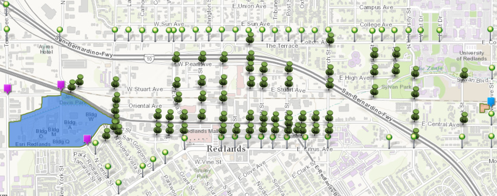
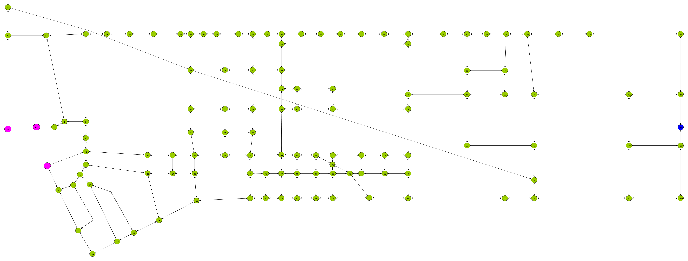
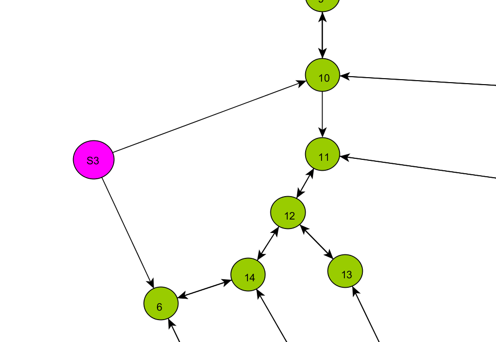
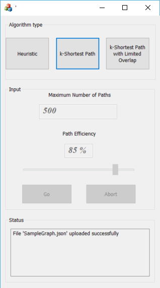

# AlternateRoutes
A .NET Application that calculates alternate routes.

# Introduction
I began my internship in Redlands, CA Summer 2017, where I carpooled to and from work each day.
The first few days, we used Google Maps in order to get home. We hoped we would memorize the
path home eventually. To our surprise, Google Maps put us on a different route home each day.

Based on this, we decided to make it our mission to take a different path home, for the duration of 
the internship. I decided to write an algorithm that would give us different paths home and I
built an application to do it.

## Data set
I used [ArcGIS online](http://www.arcgis.com/home/webmap/viewer.html?webmap=b2cb612edf4b441584cff9f7c49133b0) to create a map that would eventually
turn into a graph structure.



I converted it to a graph and calculated the distance between each node:

 

The application uses .json as input (using a script) to create a representation of
an undirected graph as well as specify the starting and ending nodes. The syntax goes as follows:
```json
{
	"starting" : "node1",
	"ending" : "node5",
	"nodes" : ["node1","node2","node3","node4","node5"],
	"edges" : [
		{
			"association" : ["node1","node2"], "weight" : 1.0
		},
		{
			"association" : ["node2","node3"], "weight" : 2.3
		},
		{
			"association" : ["node3","node4"], "weight" : 1.8
		},
		{
			"association" : ["node4","node5"], "weight" : 6.8
		}]
		
}
```

## Execution
The MFC Visual C++ program prompts you to upload the .json file. Please see the sample data to get started.
After that, you can choose one of three algorithms using the designed user interface:

 

Based on your selection, additional input parameters may be required.

When done, a user can select "Go" in order to execute the algorithm. There is an option to halt execution
in case something goes awry.

# Algorithms
In this application, my solution is labelled as the Heuristic Algorithm. The other two are implementations of existing routing solutions that I could use to practice and compare results.

## Heuristic (In Progress)
I simply needed to find permutations of the Dijkstra's shortest path in order to come up with different paths
home. I realized I could simply take away certain edges until I have the number of paths I wanted.
I could queue up the edges and "dance" around them.

However, a simpler approach to my problem was to define a path efficiency threshold and then run a Depth First Search
on the graph. If a path reachs the ending node and it is within a specified path efficiency (relative
to the shortest path solution), then it is good enough to be included in the set.

Inputs:
- Number of paths desired
- Path efficiency

## k-Shortest Path problem (Pending)
Practice algorithm implementation by following David Eppstein's solution for finding the
[k-shortest path](https://en.wikipedia.org/wiki/K_shortest_path_routing).

## k-Shortest Path with Minimal Overlap (Pending)
One step further, apply the problem to finding the shortest path, but limiting the amount of overlap
between routes. Academic reference: [Alternative Routing: k-Shortest Paths with Limited Overlap](http://cs.au.dk/~bouros/docs/sigspatial15.pdf).